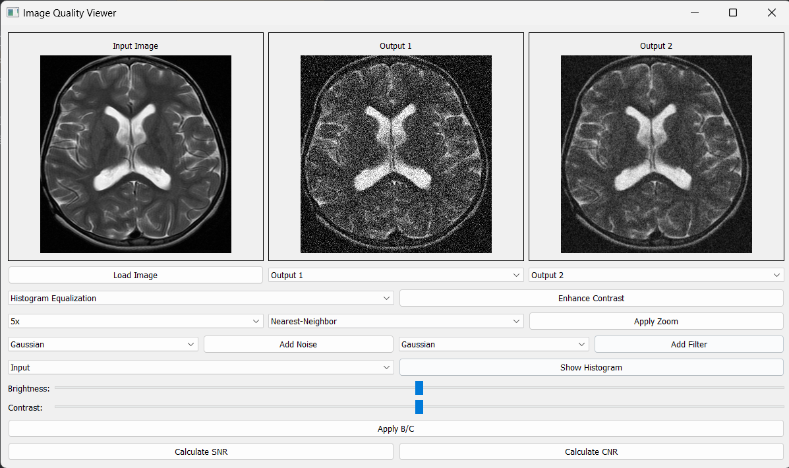
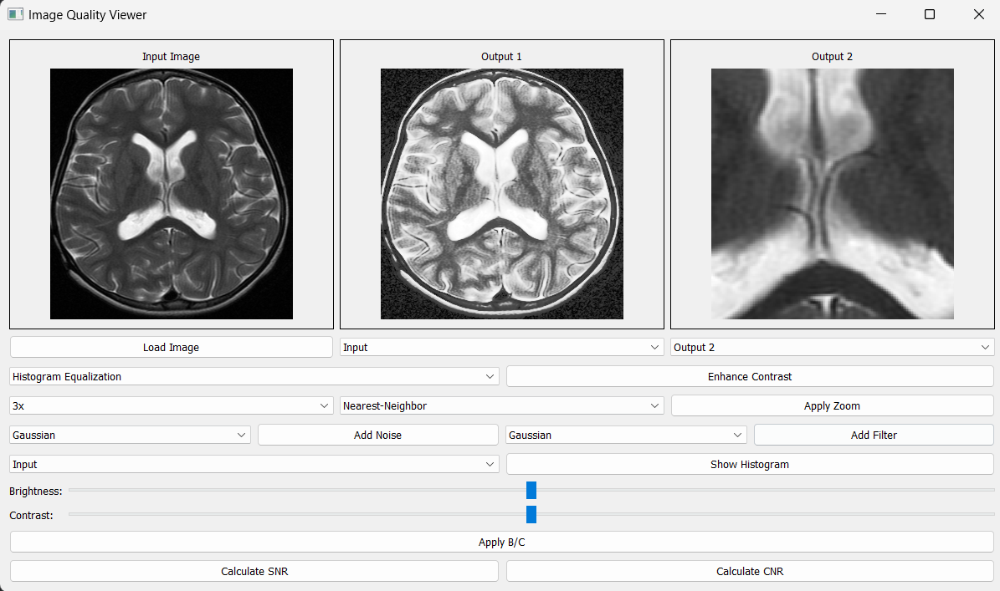
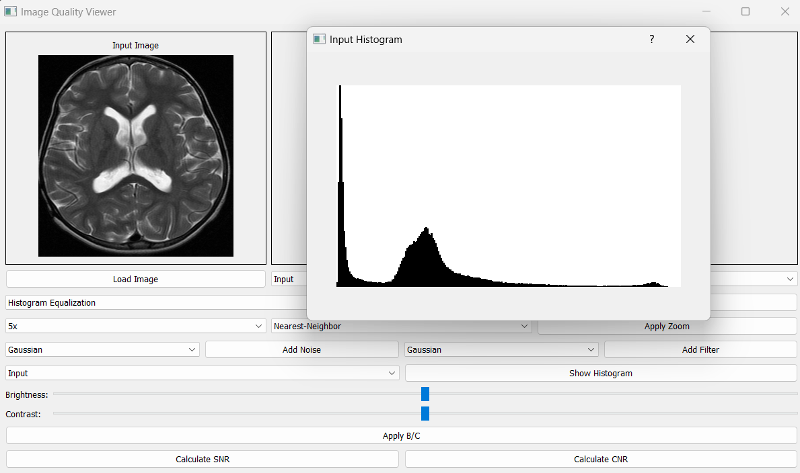
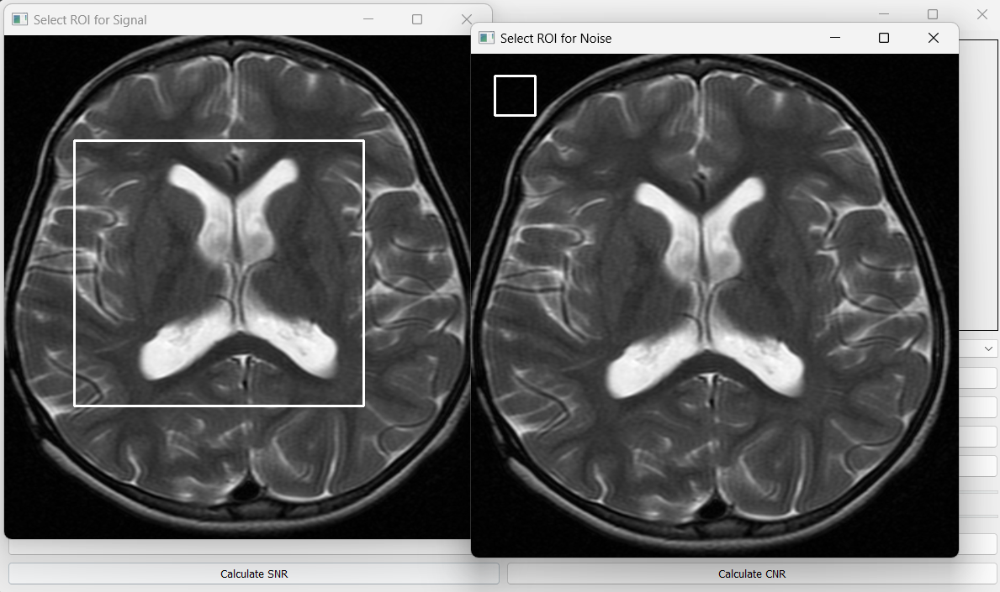

# Image Quality Viewer

## Overview

Image Quality Viewer is a standalone desktop application developed for the purpose of analyzing and enhancing medical and scientific images. It is equipped with a wide range of tools for image processing, including contrast enhancement, noise simulation, filtering, and quantitative quality assessment. This tool is especially suited for professionals in the fields of biomedical engineering, medical imaging, and scientific research.

The application provides a three-panel interface—Input, Output 1, and Output 2—allowing users to compare original and processed images simultaneously. Real-time updates and side-by-side viewing facilitate more effective image quality evaluation.


## Features

### Image Loading and Display
- Supports commonly used image formats: PNG, JPG, BMP  
- Synchronized viewing of original and processed images  
- Three display panels for parallel comparison

### Image Enhancement
- Histogram Equalization  
- CLAHE (Contrast Limited Adaptive Histogram Equalization)  
- Gamma Correction  
- Brightness and Contrast adjustment via sliders

### Zoom and Interpolation
- Zoom levels ranging from 0.25x to 5x  
- Multiple interpolation methods:
  - Nearest-Neighbor  
  - Linear  
  - Bilinear  
  - Cubic  

### Noise Simulation
- Gaussian noise  
- Salt and Pepper noise  
- Speckle noise  

### Image Filtering
- Gaussian filter  
- Bilateral filter  
- Non-Local Means denoising  
- Low-Pass filter  
- High-Pass filter  

### Image Analysis
- Real-time histogram visualization  
- SNR (Signal-to-Noise Ratio) calculation  
- CNR (Contrast-to-Noise Ratio) calculation  

---

### ScreenShots
   #### Output 1: Noise Added — Output 2: Filter Applied             

   ####Output 1: Contrast Enhancement — Output 2: 3x Zoom
 
  #### Input Image Histogram (Pixel Count vs Intensity)

  #### ROI Selection for SNR and CNR Calculation  



## Installation

Install the required Python libraries using the following commands:

```bash
pip install PyQt5
pip install opencv-python
pip install numpy
pip install matplotlib
```

## How to Run
To start the application, run:
```bash
python MultiViewBoard.py
```

## Basic Usage:
   - Click "Load Image" to open an image file
   - Select the source image (Input/Output1/Output2) from the dropdown
   - Choose the target output window (Output1/Output2)
   - Apply desired operations using the control panel

### Enhancement Operations:
   - Select enhancement type (Histogram Equalization/CLAHE/Gamma Correction)
   - Click "Enhance Contrast" to apply
   - Adjust brightness/contrast using sliders
   - Click "Apply B/C" to apply brightness/contrast changes

### Noise and Filtering:
   - Select noise type (Gaussian/Salt and Pepper/Speckle)
   - Click "Add Noise" to apply
   - Select filter type (Gaussian/Bilateral/Non-Local Means/Low-Pass/High-Pass)
   - Click "Add Filter" to apply

### Analysis:
   - Click "Show Histogram" to view intensity distribution
   - Use "Calculate SNR" to measure Signal-to-Noise Ratio
   - Use "Calculate CNR" to measure Contrast-to-Noise Ratio

## Quality Metrics
### SNR Calculation

- Requires selecting two ROIs: one for signal, one for noise.
- Computed as:

```python
SNR = mean(signal) / std(noise)

```
### CNR Calculation
- Requires selecting two ROIs and a third for noise
- Computed as:

```python
CNR = abs(mean(region1) - mean(region2)) / std(noise)
```


## Interface Overview

- Main display area with three image panels.
- Control panel with options for:
  - Enhancement methods
  - Noise types
  - Filters
  - Zoom and interpolation
- Sliders for adjusting brightness and contrast.
- Tools for ROI selection and metric calculation.

---

## Acknowledgments

This project would not have been possible without the guidance and support of **Dr. Tamer Basha**, whose expertise greatly contributed to both the development and refinement of this application.

We also acknowledge the contributions of the open-source software community for providing the tools and libraries that made this application feasible.
